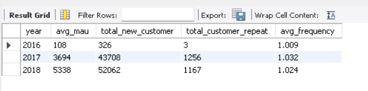
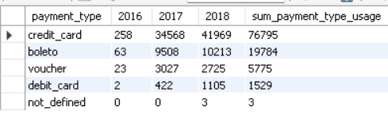

# 💰 **Analyzing E-Commerce Business Performance with SQL**
<br>

**Tool** : PostgreSQL <br> 
**Visualization** : Microsoft Excel <br>
**Dataset** : Rakamin Academy - [Ecommerce Data]()
<br>
<br>

**Table of Contents**
- [STAGE 0: Problem Statement](https://github.com/faizns/Analyzing-eCommerce-Business-Performance-with-SQL/blob/main/README.md#-stage-0:-problem-statement)
	- [Background Story](https://github.com/faizns/Analyzing-eCommerce-Business-Performance-with-SQL/blob/main/README.md#background-story)
	- [Objective](https://github.com/faizns/Analyzing-eCommerce-Business-Performance-with-SQL/blob/main/README.md#objective)
- [STAGE 1: Data Preparation](https://github.com/faizns/Analyzing-eCommerce-Business-Performance-with-SQL/blob/main/README.md#-stage-1:-Data-Preparation)
	- [Create Database and ERD](https://github.com/faizns/Analyzing-eCommerce-Business-Performance-with-SQL/blob/main/README.md#create-database-and-erd)
- [STAGE 2: Data Analysis](https://github.com/faizns/Analyzing-eCommerce-Business-Performance-with-SQL/blob/main/README.md#-stage-2:-data-analysis)
	- [Annual Customer Activity Growth](https://github.com/faizns/Analyzing-eCommerce-Business-Performance-with-SQL/blob/main/README.md#1-annual-customer-activity-growth)
	- [Annual Product Category Quality](https://github.com/faizns/Analyzing-eCommerce-Business-Performance-with-SQL/blob/main/README.md#2-annual-product-category-quality)
	- [Annual Payment Type Usage](https://github.com/faizns/Analyzing-eCommerce-Business-Performance-with-SQL/blob/main/README.md#3-annual-payment-type-usage)
- [STAGE 3: Summary](https://github.com/faizns/Analyzing-eCommerce-Business-Performance-with-SQL/blob/main/README.md#-stage-3:-summary)
<br>
<br>

---

## 📂 **STAGE 0: Problem Statement**

### **Background Story**
Measuring business performance is very important for a company. This will help in monitoring and assessing the success or failure of various business processes. Measurement of business performance can be done by considering several business metrics. In this project, an analysis of the business performance of an e-commerce company will be carried out using business metrics, namely customer growth, product quality, and payment types based on historical data for three years.

### **Objective**
Gather insight from analysis and visualization in the form of:
1. **Annual Customer Activity Growth**
2. **Annual Product Category Quality**
3. **Annual Payment Type Usage**
<br>
<br>

---

## 📂 **STAGE 1: Data Preparation**

The dataset used is the dataset of a Brazilian eCommerce company that has order information with the number 99441 from 2016 to 2018. There are features that make information such as order status, location, item details, type of payment, and reviews.

### **Create Database and ERD**
**The steps taken include:**
1. 1.	Create a database workspace in pgAdmin and create a table using the CREATE TABLE statement
2. 2.	Import csv data into database
3. 3.	Determine the Primary Key or Foreign Key using  `ALTER TABLE`
4. 4.	Create and export ERD (Entity Relationship Diagram) <br>

<details>
  <summary>Click to view Queries</summary>
  
  ```sql
Create database db4;
use db4;


CREATE TABLE customers_dataset (
  customer_id varchar(100),
  customer_unique_id varchar(100),
  customer_zip_code_prefix varchar(100),
  customer_city varchar(100),
  customer_state varchar(100)
);
CREATE TABLE sellers_dataset (
  seller_id varchar(100),
  seller_zip_code_prefix varchar(100),
  seller_city varchar(100),
  seller_state varchar(100)
);
CREATE TABLE geolocation_dataset (
  geolocation_zip_code_prefix varchar(100),
  geolocation_lat decimal,
  geolocation_lng decimal,
  geolocation_city varchar(100),
  geolocation_state varchar(100)
);
CREATE TABLE product_dataset (
  product_id varchar(100),
  product_category_name varchar(100),
  product_name_lenght int,
  product_description_lenght int,
  product_photos_qty int,
  product_weight_g decimal,
  product_length_cm decimal,
  product_height_cm decimal,
  product_width_cm decimal
);
CREATE TABLE orders_dataset (
  order_id varchar(100),
  customer_id varchar(100),
  order_status varchar(100),
  order_purchase_timestamp timestamp,
  order_approved_at timestamp,
  order_delivered_carrier_date timestamp,
  order_delivered_customer_date timestamp,
  order_estimated_delivery_date timestamp
);
CREATE TABLE order_items_dataset (
  order_id varchar(100),
  order_item_id int,
  product_id varchar(100),
  seller_id varchar(100),
  shipping_limit_date timestamp,
  price decimal,
  fright_value decimal
);
CREATE TABLE order_payments_dataset (
  order_id varchar(100),
  payment_sequential int,
  payment_type varchar(100),
  payment_installments int,
  payment_value decimal
);
CREATE TABLE order_reviews_dataset (
  review_id varchar(100),
  order_id varchar(100),
  review_score int,
  review_comment_title varchar(100),
  review_comment_message varchar(100),
  review_creation_date timestamp,
  review_answer_timestamp timestamp
);

-- 3) Import the csv file into each of the tables that have been created by right-clicking on the table name > Import/Export Data..

-- 4) Determine the Primary Key and Foreign Key to create a relationship between the tables, 
-- Previously, ensure that the Primary Key has a unique value and the data type matches the Primary Key and Foreign Key in the dataset.
-- PRIMARY KEY
ALTER TABLE customers_dataset ADD CONSTRAINT customers_dataset_pkey PRIMARY KEY (customer_id);
ALTER TABLE sellers_dataset ADD CONSTRAINT sellers_dataset_pkey PRIMARY KEY (seller_id);
ALTER TABLE product_dataset ADD CONSTRAINT product_dataset_pkey PRIMARY KEY (product_id);
ALTER TABLE orders_dataset ADD CONSTRAINT orders_dataset_pkey PRIMARY KEY (order_id);


-- FOREIGN KEY
 ALTER TABLE orders_dataset ADD FOREIGN KEY (customer_id) REFERENCES customers_dataset (customer_id);
ALTER TABLE order_payments_dataset ADD FOREIGN KEY (order_id) REFERENCES orders_dataset (order_id);
ALTER TABLE order_reviews_dataset ADD FOREIGN KEY (order_id) REFERENCES orders_dataset (order_id);
ALTER TABLE order_items_dataset ADD FOREIGN KEY (order_id) REFERENCES orders_dataset (order_id);
ALTER TABLE order_items_dataset ADD FOREIGN KEY (product_id) REFERENCES product_dataset (product_id);
ALTER TABLE order_items_dataset ADD FOREIGN KEY (seller_id) REFERENCES sellers_dataset (seller_id);


-- 5) Create ERD by right-clicking on the ecommerce_miniproject database > Generate ERD..
  ```
</details>

**Hasil ERD :** <br>
<p align="center">
  <kbd> </kbd> <br>
  Gambar 1. Entity Relationship Diagram
</p>
<br>
<br>

---

## 📂 **STAGE 2: Data Analysis**

### **1. Annual Customer Activity Growth**
Annual customer activity growth can be analyzed from Monthly active users (MAU), new customers, customers with repeat orders, and average orders by customers.

<details>
  <summary>Click to view Queries</summary>
  
  ```sql
 use db4;


-- 1 Displays the average number of monthly active users (monthly active users) for each year

SELECT 
    year,
    FLOOR(AVG(customer_total)) AS avg_mau
FROM (
    SELECT 
        EXTRACT(year FROM od.order_purchase_timestamp) AS year,
        EXTRACT(month FROM od.order_purchase_timestamp) AS month,
        COUNT(DISTINCT cd.customer_unique_id) AS customer_total
    FROM orders_dataset AS od
    JOIN customers_dataset AS cd
        ON cd.customer_id = od.customer_id
    GROUP BY 1, 2
) AS sub
GROUP BY year
ORDER BY year;


-- Create a new table to store the results
CREATE TABLE avg_mau_table (
    year INT PRIMARY KEY,
    avg_mau INT
);

-- Insert the computed averages into the new table
INSERT INTO avg_mau_table (year, avg_mau)
SELECT 
    year,
    FLOOR(AVG(customer_total)) AS avg_mau
FROM (
    SELECT 
        EXTRACT(year FROM od.order_purchase_timestamp) AS year,
        EXTRACT(month FROM od.order_purchase_timestamp) AS month,
        COUNT(DISTINCT cd.customer_unique_id) AS customer_total
    FROM orders_dataset AS od
    JOIN customers_dataset AS cd
        ON cd.customer_id = od.customer_id
    GROUP BY 1, 2
) AS sub
GROUP BY year
ORDER BY year;


-- 2 Displays the number of new customers in each year

SELECT 
    year,
    COUNT(customer_unique_id) AS total_new_customer
FROM (
    SELECT
        EXTRACT(year FROM od.order_purchase_timestamp) AS year,
        cd.customer_unique_id
    FROM orders_dataset AS od
    JOIN customers_dataset AS cd
        ON cd.customer_id = od.customer_id
    GROUP BY year, cd.customer_unique_id
) AS sub
GROUP BY year
ORDER BY year;


-- 3 Displays the number of customer repeat orders in each year


SELECT 
    year,
    COUNT(customer_unique_id) AS total_customer_repeat
FROM (
    SELECT
        EXTRACT(year FROM od.order_purchase_timestamp) AS year,
        cd.customer_unique_id,
        COUNT(od.order_id) AS total_order
    FROM orders_dataset AS od
    JOIN customers_dataset AS cd
        ON cd.customer_id = od.customer_id
    GROUP BY year, cd.customer_unique_id
    HAVING COUNT(od.order_id) > 1
) AS sub
GROUP BY year
ORDER BY year;


-- 4 Displays the average number of orders made by customers for each year


SELECT 
    year,
    ROUND(AVG(freq), 3) AS avg_frequency
FROM (
    SELECT
        EXTRACT(year FROM od.order_purchase_timestamp) AS year,
        cd.customer_unique_id,
        COUNT(od.order_id) AS freq
    FROM orders_dataset AS od
    JOIN customers_dataset AS cd
        ON cd.customer_id = od.customer_id
    GROUP BY year, cd.customer_unique_id
) AS sub
GROUP BY year
ORDER BY year;


-- 5 Combines the three metrics that have been successfully displayed into one table view

SET GLOBAL wait_timeout = 600;


SET GLOBAL interactive_timeout = 600;


SET @@local.net_read_timeout=360;


WITH cte_mau AS (
  SELECT year, FLOOR(AVG(customer_total)) AS avg_mau
  FROM (
    SELECT 
      EXTRACT(year FROM od.order_purchase_timestamp) AS year,
      EXTRACT(month FROM od.order_purchase_timestamp) AS month,
      COUNT(DISTINCT cd.customer_unique_id) AS customer_total
    FROM orders_dataset AS od
    JOIN customers_dataset AS cd
      ON cd.customer_id = od.customer_id
    GROUP BY 1, 2
  ) AS sub
  GROUP BY year
),

cte_new_cust AS (
  SELECT year, COUNT(customer_unique_id) AS total_new_customer
  FROM (
    SELECT
      MIN(EXTRACT(year FROM od.order_purchase_timestamp)) AS year,
      cd.customer_unique_id
    FROM orders_dataset AS od
    JOIN customers_dataset AS cd
      ON cd.customer_id = od.customer_id
    GROUP BY 2
  ) AS sub
  GROUP BY year
),

cte_repeat_order AS (
  SELECT year, COUNT(customer_unique_id) AS total_customer_repeat
  FROM (
    SELECT
      EXTRACT(year FROM od.order_purchase_timestamp) AS year,
      cd.customer_unique_id,
      COUNT(od.order_id) AS total_order
    FROM orders_dataset AS od
    JOIN customers_dataset AS cd
      ON cd.customer_id = od.customer_id
    GROUP BY 1, 2
    HAVING COUNT(od.order_id) > 1
  ) AS sub
  GROUP BY year
),

cte_frequency AS (
  SELECT year, ROUND(AVG(freq), 3) AS avg_frequency
  FROM (
    SELECT
      EXTRACT(year FROM od.order_purchase_timestamp) AS year,
      cd.customer_unique_id,
      COUNT(order_id) AS freq
    FROM orders_dataset AS od
    JOIN customers_dataset AS cd
      ON cd.customer_id = od.customer_id
    GROUP BY 1, 2
  ) AS sub
  GROUP BY year
)

SELECT
  mau.year AS year,
  avg_mau,
  total_new_customer,
  total_customer_repeat,
  avg_frequency
FROM
  cte_mau AS mau
  JOIN cte_new_cust AS nc
    ON mau.year = nc.year
  JOIN cte_repeat_order AS ro
    ON nc.year = ro.year
  JOIN cte_frequency AS f
    ON ro.year = f.year
ORDER BY year;
  ```
</details>

<p align="center">
Graph 1. Results of Annual Revenue Growth Analysis  <br>
  <kbd> </kbd> <br>
</p>


<br>

Overall the company experienced an increase in Monthly Active Users and new customers every year. A significant increase occurred from 2016 to 2017, this is because transaction data in 2016 started in September.


<br>


### **2. Annual Product Category Quality**

Kualitas kategori produk tahunan dapat dianalisis dari total pendapatan, total pembatalan pesanan, kategori top produk dan kategori produk yang paling banyak dibatalkan.

<details>
  <summary>Click disini untuk melihat Queries</summary>

  ```sql
 --1) Membuat tabel yang berisi informasi pendapatan/revenue perusahaan total untuk masing-masing tahun
CREATE TABLE total_revenue AS
	SELECT
		date_part('year', od.order_purchase_timestamp) AS year,
		SUM(oid.price + oid.fright_value) AS revenue
	FROM order_items_dataset AS oid
	JOIN orders_dataset AS od
		ON oid.order_id = od.order_id
	WHERE od.order_status like 'delivered'
	GROUP BY 1
	ORDER BY 1;

--2) Membuat tabel yang berisi informasi jumlah cancel order total untuk masing-masing tahun
CREATE TABLE canceled_order AS
	SELECT
		date_part('year', order_purchase_timestamp) AS year,
		COUNT(order_status) AS canceled
	FROM orders_dataset
	WHERE order_status like 'canceled'
	GROUP BY 1
	ORDER BY 1;
		
--3) Membuat tabel yang berisi nama kategori produk yang memberikan pendapatan total tertinggi untuk masing-masing tahun
CREATE TABLE top_product_category AS
	SELECT 
		year,
		top_category,
		product_revenue
	FROM (
		SELECT
			date_part('year', shipping_limit_date) AS year,
			pd.product_category_name AS top_category,
			SUM(oid.price + oid.fright_value) AS product_revenue,
			RANK() OVER (PARTITION BY date_part('year', shipping_limit_date)
					 ORDER BY SUM(oid.price + oid.fright_value) DESC) AS ranking
		FROM orders_dataset AS od 
		JOIN order_items_dataset AS oid
			ON od.order_id = oid.order_id
		JOIN product_dataset AS pd
			ON oid.product_id = pd.product_id
		WHERE od.order_status like 'delivered'
		GROUP BY 1, 2
		ORDER BY 1
		) AS sub
	WHERE ranking = 1;
	
--4) Membuat tabel yang berisi nama kategori produk yang memiliki jumlah cancel order terbanyak untuk masing-masing tahun
CREATE TABLE most_canceled_category AS
	SELECT 
		year,
		most_canceled,
		total_canceled
	FROM (
		SELECT
			date_part('year', shipping_limit_date) AS year,
			pd.product_category_name AS most_canceled,
			COUNT(od.order_id) AS total_canceled,
			RANK() OVER (PARTITION BY date_part('year', shipping_limit_date)
					 ORDER BY COUNT(od.order_id) DESC) AS ranking
		FROM orders_dataset AS od 
		JOIN order_items_dataset AS oid
			ON od.order_id = oid.order_id
		JOIN product_dataset AS pd
			ON oid.product_id = pd.product_id
		WHERE od.order_status like 'canceled'
		GROUP BY 1, 2
		ORDER BY 1
		) AS sub
	WHERE ranking = 1;
	
-- Tambahan - Menghapus anomali data tahun
DELETE FROM top_product_category WHERE year = 2020;
DELETE FROM most_canceled_category WHERE year = 2020;

-- Menampilkan tabel yang dibutuhkan
SELECT 
	tr.year,
	tr.revenue AS total_revenue,
	tpc.top_category AS top_product,
	tpc.product_revenue AS total_revenue_top_product,
	co.canceled total_canceled,
	mcc.most_canceled top_canceled_product,
	mcc.total_canceled total_top_canceled_product
FROM total_revenue AS tr
JOIN top_product_category AS tpc
	ON tr.year = tpc.year
JOIN canceled_order AS co
	ON tpc.year = co.year
JOIN most_canceled_category AS mcc
	ON co.year = mcc.year
GROUP BY 1, 2, 3, 4, 5, 6, 7;
  ```
</details>

<p align="center">
  Tabel 2. Hasil Analisis Total Kategori Produk Tahunan <br>
  <kbd> </kbd> <br>
</p>

<br>
<p align="center">
  <kbd> </kbd> <br>
  Gambar 5. Grafik Total Revenue Pertahun
</p>

Secara keseluruhan revenue perusahaan meningkat setiap tahun. <br>
<br>
<br>

<p align="center">
  <kbd> </kbd> <br>
  Gambar 6. Grafik Total Revenue Top Produk Pertahun
</p>

Revenue yang dihasilkan dari top produk juga meningkat untuk setiap tahunnya. Selain itu setiap tahunnya memiliki jenis kategori top produk yang berbeda. Pada tahun 2018, perusahaan menghasilkan revenue paling tinggi dengan jenis karegori top produk kesehatan dan kecantikan (`health_beauty`). <br>
<br>
<br>

<p align="center">
  <kbd> </kbd> <br>
  Gambar 7. Grafik Total Revenue Top Produk Pertahun
</p>

Produk yang sering dibatalkan oleh pelanggan untuk setiap tahunnya juga memiliki jenis kategori yang berbeda dan terus mengalami kenaikan. Tahun 2018 memiliki jumlah produk yang dibatalkan paling banyak dan memiliki jenis kategori yang sama dengan top produk yang paling banyak menghasilkan revenue. Hal tersebut dapat diduga karena jenis kategori kesehatan dan kecantikan sedang mendominasi pasar.  <br>
<br>

### **3. Annual Payment Type Usage**
Tipe pembayaran yang digunakan pelanggan dapat dianalisis dari jenis pembayaran favorit dan jumlah penggunaan untuk setiap jenis pembayaran pertahun. 

<details>
  <summary>Click untuk melihat Queries</summary>

  ```sql
-- 1) Menampilkan jumlah penggunaan masing-masing tipe pembayaran secara all time diurutkan dari yang terfavorit
SELECT payment_type, COUNT(1) 
FROM order_payments_dataset
GROUP BY 1
ORDER BY 2 DESC;

-- 2)Menampilkan detail informasi jumlah penggunaan masing-masing tipe pembayaran untuk setiap tahun
SELECT
	payment_type,
	SUM(CASE WHEN year = 2016 THEN total ELSE 0 END) AS "2016",
	SUM(CASE WHEN year = 2017 THEN total ELSE 0 END) AS "2017",
	SUM(CASE WHEN year = 2018 THEN total ELSE 0 END) AS "2018",
	SUM(total) AS sum_payment_type_usage
FROM (
	SELECT 
		date_part('year', od.order_purchase_timestamp) as year,
		opd.payment_type,
		COUNT(opd.payment_type) AS total
	FROM orders_dataset AS od
	JOIN order_payments_dataset AS opd 
		ON od.order_id = opd.order_id
	GROUP BY 1, 2
	) AS sub
GROUP BY 1
ORDER BY 2 DESC;
  ```
</details>

<p align="center">
  Tabel 3. Hasil Analisis Tipe Pembayaran yang Digunakan Pelanggan <br>
  <kbd> </kbd> <br>
</p>

<br>
<p align="center">
  <kbd> </kbd> <br>
  Gambar 8. Grafik Tipe Pembayaran yang Digunakan Pelanggan Pertahun
</p>

Mayoritas pelanggan melakukan pembayaran menggunakan kartu kredit dan cenderung mengalami peningkatan setiap tahunnya. Pembayaran menggunakan voucher meningkat pada tahun 2017, namun menurun pada tahun 2018. Hal tersebut dapat diduga karena ketersediaan voucher yang diberikan perusahaan lebih sedikit dari tahun lalu. Disisi lain, pelanggan yang melakukan pembayaran dengan kartu debit meningkat secara signifikan pada tahun 2018. Hal tersebut dapat diduga karena kemungkinan terdapat promosi pembayaran untuk kartu debit, sehingga banyak pelanggan yang tertarik untuk menggunakan metode tersebut.
<br>
<br>


---

## 📂 **STAGE 3: Summary**
- Dilihat dari analisis pertumbuhan tahunan pelanggan dapat disimpulkan bahwa **jumlah pelanggan baru dan aktif (MAU) meningkat setiap tahunnya**, namun pelanggan cenderung tidak repeat order atau hanya melakukan pembelian satu kali. Dari hal tersebut perlu adanya strategi bisnis untuk meningkatkan minat pelanggan agar melakukan pembelian misalnya dengan pemberian promo, *call to action*, dan lain sebagainya.
- Dari analisis kualitas produk tahunan, **revenue terus meningkat dengan kategori produk yang berbeda setiap tahunnya**. Kategori **kesehatan dan kecantikan** menjadi produk best seller sekaligus produk yang paling sering dibatalkan pembeliannya pada tahun 2018. Berdasarkan hasil analisis ini dapat dilakukan strategi bisnis berupa riset produk apa yang akan menjadi trend di tahun selanjutnya, sehingga diharapkan dapat memperbesar peluang perusahaan mendapatkan revenue.
- **Kartu kredit** merupakan tipe pembayaran mayoritas yang digunakan oleh pelanggan.


